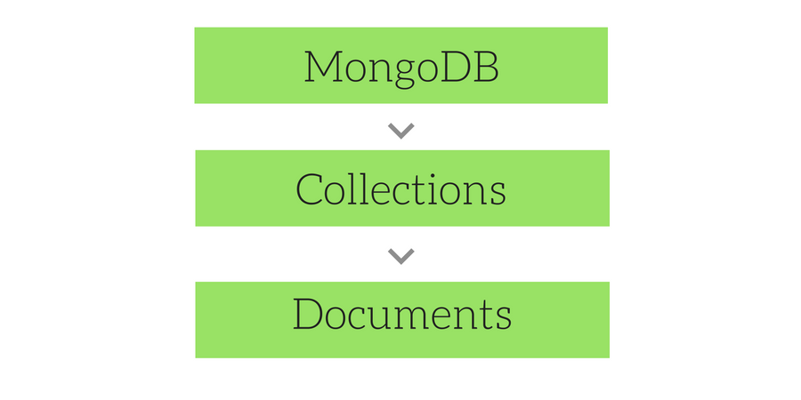

## Collection & Documents

Mongodb stores data records as documents (BSON documents),which are gathered together in collections.

MongoDb stores **Documents** In **Collections**.  
MongoDb Stores **Data records** in **Document**.

if you are coming from relational databases the relatively comparative view would be the diagram below. Unlike relational databases though we don't use documents collections , documents and fields as schemas.

** starting mongodb 3.2 we can enforce document validation rules for a collection during update and insert operations.

