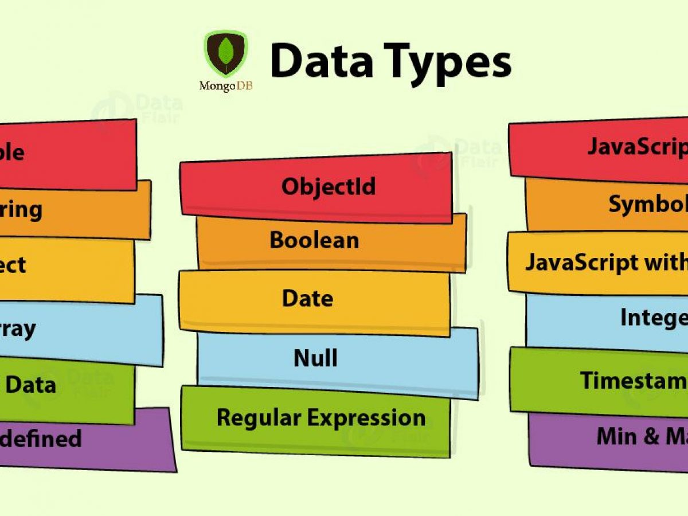

## BSON

A binary serialization format used **to store documents** and make remote procedure calls in mongodb.

JSON is a subset of types supported by BSON. BSON adds support for data types, such as date and binary which are not supported in JSON. BSON types allow us to store [Key] -> [value + type] pairs.

**BSON Types allow us to query documents not only by value but also by type. using $type operator**

### BSON Types



BSON Types have an identifiers that are used to query documents by types. BSON types have a unique **Number ID** and **String ID**. we use this identifiers using the **$type** operator in queries.

Below you can find the full list of BSON Types and their identifiers:

| Type                       | Number | Alias                 | Notes                      |
| -------------------------- | ------ | --------------------- | -------------------------- |
| Double                     | 1      | “double”              |                            |
| String                     | 2      | “string”              |                            |
| Object                     | 3      | “object”              |                            |
| Array                      | 4      | “array”               |                            |
| Binary data                | 5      | “binData”             |                            |
| Undefined                  | 6      | “undefined”           | Deprecated.                |
| ObjectId                   | 7      | “objectId”            |                            |
| Boolean                    | 8      | “bool”                |                            |
| Date                       | 9      | “date”                |                            |
| Null                       | 10     | “null”                |                            |
| Regular Expression         | 11     | “regex”               |                            |
| DBPointer                  | 12     | “dbPointer”           | Deprecated.                |
| JavaScript                 | 13     | “javascript”          |                            |
| Symbol                     | 14     | “symbol”              | Deprecated.                |
| JavaScript code with scope | 15     | “javascriptWithScope” | Deprecated in MongoDB 4.4. |
| 32-bit integer             | 16     | “int”                 |                            |
| Timestamp                  | 17     | “timestamp”           |                            |
| 64-bit integer             | 18     | “long”                |                            |
| Decimal128                 | 19     | “decimal”             | New in version 3.4.        |
| Min key                    | \-1    | “minKey”              |                            |
| Max key                    | 127    | “maxKey”              |

- **String**
  - most commonly used datatype to store data. String in MongoDB must be UTF-8.
- **Boolean**
  - Use to store a boolean(true or false) value.
- **Null**
  - used to store Null value
- **Timestamps**
  - handy for recording when a document has been created or modified.
- **Array**
  - used to store list, array or multiple values into one key.
- **Object**
  - Used to embede documents inside one antoher.
- **ObjectId**
  - We must supply type information **ObjectId()** with the value
  - small, **likely** unique, fast to generate and **ordered**.
  - 12 bytes in length
    - 4 byte timestamp
    - 5 byte random value
    - 3 byte increment in counter, initialized to a random value
  - In mongoshell we can access the creation time of objectId using ```ObjectId.getTimestamp()```
  - Sorting on an _id field that stores ObjectId values is roughly equivalent to sorting by creation time.
  - Each document stored in a collection requires a unique _id field that acts as a primary key, if an inserted document omits the_id field, MongoDb driver automatically generates an ObjectId for the _id field.
  
- Number Types in MongoDB:

    If a type of Number is not provided to a value , MongoDB will store is as a **Double** BSON Value.

    >The reason for this is Mongodb uses javascript engine and javascript engine doesn't distinguish between integer number and decimal numbers. JavaScript numbers are always stored as double precision 64-bit floating point numbers, following the international IEEE 754 standard.

  - **32-bit Integer**
    - To save our numbers as 32-bit integers we should use **NumberInt()** type information.
  - **64-bit Integer**
    - To save our numbers as 64-bit we should use **NumberLong()** type information.
  - **Double**
    - To save our numbers as 128-bit-decimal-based floating-point values capable of emulating decimal rounding with exact precision. we should use **NumberDecimal()** type information.
- **Date**

stores floating point values.

| Type        | Alias      |
| ----------- | ---------- |
| Double      | "double"   |
| String      | "string"   |
| Object      | "object"   |
| Array       | "array"    |
| Binary Data | "binData"  |
| ObjectId    | "objectId" |
| Boolean     | "bool"     |
| Date        | "date"     |
| Null        | "null"     |

## Reference and Reading

[JSON vs BSON](https://www.geeksforgeeks.org/difference-between-json-and-bson/) <br>
[Javascript Numbers](https://www.w3schools.com/js/js_numbers.asp) <br>
[for more on BSON to JSON](https://docs.mongodb.com/manual/reference/mongodb-extended-json/)
