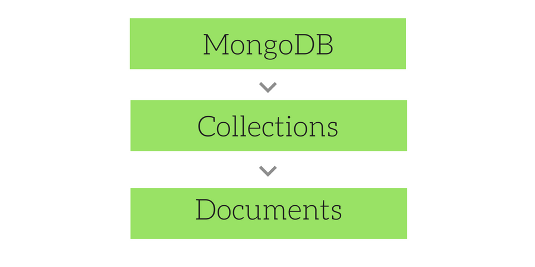
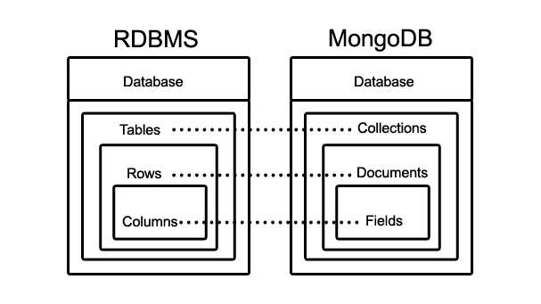

# Building Blocks of MongoDb Database

## Collection & Documents

Mongodb stores data records as documents (BSON documents),which are gathered together in collections.

MongoDb stores **Documents** In **Collections**. <br>
MongoDb Stores **Data records** in **Document**.



if you are coming from relational databases the relatively comparative view would be the diagram below. Unlike relational databases though we don't use documents collections , documents and fields as schemas.

** starting mongodb 3.2 we can enforce document validation rules for a collection during update and insert operations.



## BSON

A binary serialization format used to store documents and make remote procedure calls in mongodb.
JSON is a subset of types supported by BSON. BSON adds support for data types, such as date and binary which are not supported in JSON.

[for more on BSON to JSON](https://docs.mongodb.com/manual/reference/mongodb-extended-json/)

### BSON Types

#### Double

stores floating point values.

| Type        | Alias      |
| ----------- | ---------- |
| Double      | "double"   |
| String      | "string"   |
| Object      | "object"   |
| Array       | "array"    |
| Binary Data | "binData"  |
| ObjectId    | "objectId" |
| Boolean     | "bool"     |
| Date        | "date"     |
| Null        | "null"     |

## Views

Mongodb View is a queryable object whose contents are defined by aggregation pipeline on other collections or views.
MongoDB does not persist the view contents to disk. A view’s content is computed on-demand when a client queries the view.

Write Operations against views are not supported. i.e. they are readonly

## Storage Engines

## Types

## Operators

### Query Operators

### Update Operators

### Aggregate

## Exit Code and Statuses

## Limitations

- The maximum BSON Document size is 16 megabyets.
  - Why ? it helps ensure that a single document can not use excessive amount of RAM or during transmission excessive amount of bandwidth. To store documents larger than the maximum size , Mongodb provides the GridFS API.
- Nested Depth for BSON Documents
  - MongoDb supports no more than 100 levels of nesting for BSON Documents.
- Naming restrictions
  - Database names are case **insensitive**
    - On Windows database names can not include ``` \/."$.<>:|? ``` and null character
    - on Linux/Unix systems database names can not contain ```/\. "$``` and null character
  - Collection Names
    - Should being with an underscore or a letter character
    - Can not
      - contain $
      - be an empty string
      - contain null character
      - begin with the system. prefix (reserved for internal use).
  - Field Names
    - Field names cannot contain the null character
    - Top field names can not contain the null character.

> to learn more please refere (<https://docs.mongodb.com/manual/reference/limits/#operations>)

## Hands On :zap

### lets create a MongoDB

## lets create a Collection

## lets add a document to the collection

## lets query the collection

## lets query the document

## lets add a New field to our document
