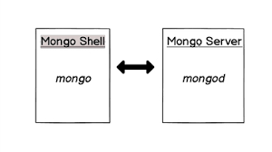

# Mongo Shell and Mongo Server



When we install MongoDb we get two applications

- **mongo server**
  - ```mongod``` command is used to launch mongo server
  - stores data in the mongoDB database
- **mongo shell**
  - ```mongo``` command is used to launch mongo shell
  - used for management of mongo server, we can insert documents , create collections ,....

Both mongoServer and mongoShell are based on the javascript engine.

We can use locally installed mongoShell to manage remote mongoservers too.

//how to tag monod?
