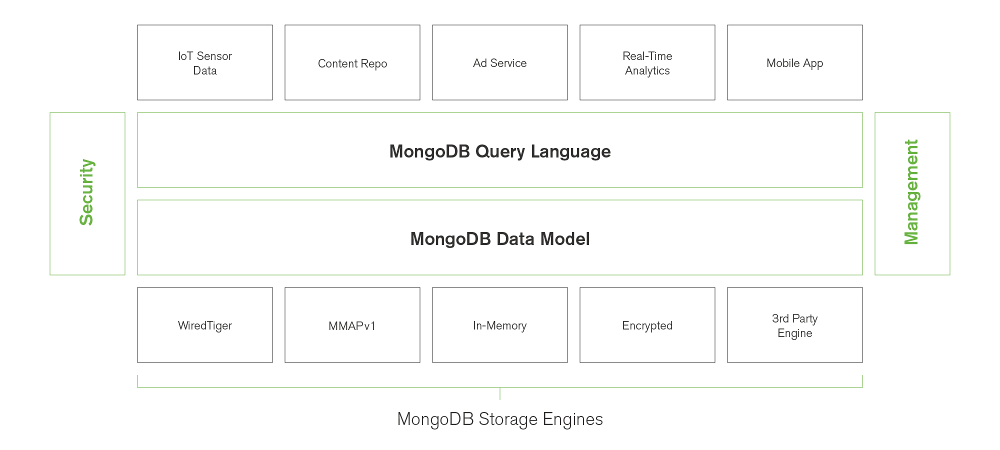

# Storage Engine

The storage engine is the component of the database that is responsible for managing how data is stored, both in memory and on disk.

MongoDB supports multiple storage engines, as different engines perform better for specific workloads.

## **WiredTiger Storage Engine (Default)**

WiredTiger is the default storage engine starting in MongoDB 3.2. It is well-suited for most workloads and is recommended for new deployments.

In a MongoDB deployment using the WiredTiger engine, the dbPath directory is managed by WiredTiger. That is, **WiredTiger needs the content of the directory as a whole to function properly.** Removing files from this directory could render WiredTiger (and thus MongoDB) unable to start.

A notable exception is the diagnostic.data directory, which contains non-personally identifiable information regarding the status of the database for troubleshooting purposes.

Some of the files created and managed by wiredtiger include:

- **WiredTiger**: the WiredTiger version file-
This text file contains the version of WiredTiger used to create the database, and is used by WiredTiger on startup to determine whether a database is present.

- **WiredTiger.wt**: the WiredTiger metadata file
The main metadata file that tracks information about which collections and indexes exist in the database, as well as the most recent durable update (checkpoint) for each of them.

- **WiredTiger.turtle**: engine configuration file for the WiredTiger.wt file
This text file contains the WiredTiger engine configuration for the WiredTiger.wt metadata file described above.

- **WiredTigerLAS.wt**: the WiredTiger lookaside file. MongoDB configures WiredTiger in-memory cache to contain no more than a specified percentage of dirty data (defaults to 20% in MongoDB 3.2.10). If the dirty data exceeds the configured number and WiredTiger is required to keep the dirty data for operational reasons, this file contains the disk spill of the dirty data.
  
- **_mdb_catalog.wt**: the MongoDB metadata file. This file contains the metadata and catalog of MongoDB databases, collections, and indexes, including which WiredTiger data file maps to each MongoDB collection or index.
  
- **WiredTiger.lock and mongod.lock**: lock files MongoDB and WiredTiger use these lock files to ensure that only a single process accesses the database at any particular time.

- **sizeStorer.wt**: the MongoDB collection size tracking file
This file contains information about the size and document count of each MongoDB collection.

- **collection-X-XXX.wt and index-X-XXX.wt**: MongoDB collection and index files
Each MongoDB collection is stored in a collection-X-XXX.wt file, and each MongoDB index is stored in a index-X-XXX.wt file. The X-XXX portion of the filename represents a random number used by WiredTiger as a unique internal identifier. If MongoDB is started with the --directoryPerDB option these files may appear in a subdirectory of the dbpath.

- **journal directory**: WiredTiger journal files,
  If a database is started **without the --nojournal option**, the database directory also contain a journal subdirectory.
  - **WiredTigerLog.XX file**, contains the Write Ahead Log (WAL) maintained by WiredTiger.

## **In-Memory Storage Engine**
  
  In-Memory Storage Engine is available in MongoDB Enterprise. Rather than storing documents on-disk, it retains them in-memory for more predictable data latencies.

  [More on this](https://docs.mongodb.com/manual/core/journaling/)
