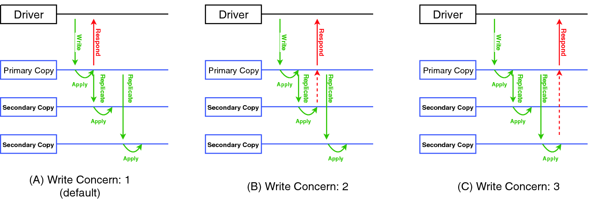

# Write Concerns



write concern describes the **level of acknowledgment** from MongoDB for write operations.

The write operation can be to a single mongod instance or replica sets or sharded clusters.

> For transactions we set write concern at transaction level not at individual operation level.

write concern is configured by using this option parameters <br>

```{ w: <value>, j: <boolean>, wtimeout: <number> }```

The **w** option and the**j** option determine when mongod instances acknowledge write operations.

| Option field | Description                                                                                                                                                 | Possible values                                                                                                                                                                                                                                                                                                                                                         |
| ------------ | ----------------------------------------------------------------------------------------------------------------------------------------------------------- | ----------------------------------------------------------------------------------------------------------------------------------------------------------------------------------------------------------------------------------------------------------------------------------------------------------------------------------------------------------------------- |
| w            | request acknowledgment that the write operation has propagated successfully to a certain number of mongod instances or mongod instances with a specific tag | **1:** requires acknowledgment from one primary instance  <br><br>  **0:** Requests no acknowledgment of the write operation <br><br> **>1:** requires acknowledgment from 1 primary and as many n-1 secondaries <br><br> **majority:** requires acknowledgment that the write operations have propagated to the calculated majority of the data-bearing voting members |
| j            | to request acknowledgment that the write operation has been written to the on disk journal                                                                  | **true**: requires acknowledgment that for all  w:<value> option (primary + secondary), data has been written to the on disk-journal. <br> * for a mongod instance where journaling is not enabled it will throw an error                                                                                                                                               |
| wtimeout     | time limit in **milliseconds** so that write operations do not block the thread                                                                             | >1: <br>0: is like specifying a write concern with out a time limit                                                                                                                                                                                                                                                                                                     |

[more reading](https://docs.mongodb.com/manual/reference/write-concern/)
