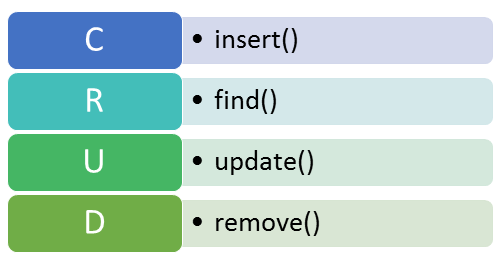

# CRUD Operations



- Create Collection on training_db

    ```db.createCollection(<name>)```

   > :zap:
    lets create a zoo collection <br>
        ```db.createCollection('zoo')```
- Insert Operations

  - Allows us to insert documents into a collection
  - Insert Operations target a single collection
  - All write operations below are **Atomic** at the level of a single document.

    - ```db.collection.insertOne``` <br>
      - 
      - Inserts a single document & returns a document that contains the newly inserted documents _id.
      - If _id is not provided , MongDB generates an_id field with an ObjectId Value

    - ```db.collection.insertMany``` <br>
      - Inserts multiple Documents into a collection.
      - We provide array of documents to insertMany . e.g [{},{},{}]
  
    - ```db.collection.insert```<br>
      - Inserts a single/multiple Documents

    <br>

    > :zap:
       Insert a Lion to the zoo collection with attributes name , type , category , age ,and id: 0001 <br>
        ```db.zoo.insertOne({_id:0001,name:'jack',type:'lion', category:'wildAnimal,age:5})``` <br>
        you should get a response like
        ```{"acknowledged:true, insertedId:1}```

    <br>

    > :zap:
        Insert a Hyena and cheetah to your zoo collection using  insertMany <br>
        ```db.zoo.insertMany([{name:'jacki',type:'hyena',category:'wildAnimal',age: 2},{_id: 0002, name:'bolt',type:'cheetah',category:'wildAnimal',age:6}])```

- Read Operations
  
  - Allows us to retrieve documents from a collection.
  
    - ``` db.collection.find() ```
        
      - You can specify **query filters or criteria** inside the find method to query documents by conditions.
  
      - to specify no criteria ,  provide the empty document {}.

    > :zap: Find all animals in our zoo collection <br>
        ```db.zoo.find({})```
    <br> <br>
    > :zap: Find an animal in zoo by their name <br>
        ```db.zoo.find({name:'jackie'})```
    <br><br>
    > :zap: Find an animal in our zoo older than 5 years <br>
        ``` db.zoo.find({age:{$gt: 5}}) ```
    <br><br>
    > :zap: Find an animal that is a wildAnimal  and age  less than than 5 <br>
        ``` db.zoo.find({category: 'wildAnimal' ,age:{$lt: 5}}) ```
    <br><br>
    > :zap: Find an animal that is a cheetah or age is less than 3 <br>
        ``` db.zoo.find({$or:[{type:'cheetah'},{age:{$eq:3}}]}) ```
- Update Operations
  
  - Allows us to modify existing documents in a collection. That can mean modifying existing fields or adding new fields to a document.
  
  - we can not update _id field.
  
    - ``` db.collection.updateOne ```
      - To modify a single document
    - ``` db.collection.updateMany ```
         
      - To modify multiple documents
    - ``` db.collection.replaceOne ```
      - To replace **the first matching** document in the collection that matches the filter.
      - You can replace the entire content of a file except the _id field
      - Takes two sets of arguments ;
        - Filter Criteria to the collection
        - new document fields to replace the old one with.
       <br><br>

    > :zap: Add colorBlind field to our hyena jackie <br>
      ```db.zoo.updateOne({name:'jackie'},{$set:{colorBlind:true}})```
    <br><br>
    > :zap: Add favorite food STEAK to all wildAnimals in our zoo collection <br>
        ```db.zoo.updateMany({},{$set:{favoriteFood: 'steak'}})```
    <br><br>
    > :zap: Change favorite food for our cheetah Bolt to Burger. <br>
        ```db.zoo.updateMany({name:'bolt'},{$set:{favoriteFood:'burger'}})```
    <br><br>
    > :zap: we don't need jackie the hyenas colorBlind field any more<br>
        ```db.zoo.replaceOne({name:'jackie'},{name:'jackie',type:'hyena',category:'wildAnimal',age:2,favoriteFood:'steak'})```
    <br><br>

- Delete Operations
  - Allows us to  delete documents from a collection. MongoDB provides two delete methods:
    - ```db.collection.deleteOne```
    - ```db.collection.deleteMany```

       
    <br><br>

    > :zap: lets remove our hyena jackie from the zoo. <br>
        ```db.zoo.deleteOne({name:'jackie'})```
    <br><br>
    > :zap: lets remove all wildAnimals in our zoo. <br>
        ```db.zoo.deleteMany({category:'wildAnimal'})```

    :( Our zoo is empty.

Lets see in detail each of the  operations on Documents:

- [Insert Documents](/course/crud/insert.md)
- [Query Documents](/course/crud/read.md)
- [Update Documents](/course/crud/update.md)
- [Delete Documents](/course/crud/delete.md)

<!-- - Bulk Write Operations
- Import and Export
- Embedded Documents
- Working with arrays
- Array of Embedded Documents
- Projection
- Dealing with Null and missing values
- working with limit and skip -->
