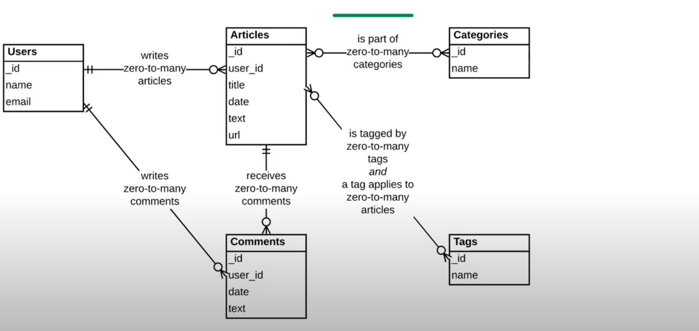
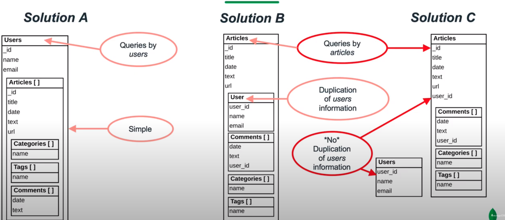

# Data Modeling

Data modeling considers different needs and characteristics of our database engine and application requirements.
when we design a model we consider the different data retrieval patterns required by applications , the write behaviors required by applications and the limitations and behavior of our database system as well.

Below it shows us the difference in data modeling with tabular based databases and mongodb.

## Tabular vs Mongodb  Data Modeling

|                           | Tabular Database                                 | MongoDB                                       |
| ------------------------- | ------------------------------------------------ | --------------------------------------------- |
| steps to create the model | 1- define schema   2- develop app and queries | 1- identify the queries   2- define schema |
| Initial Schema            | 3rd normal form   one possible solution       | many possible solutions                       |
| Final Schema              | likely demoralized                               | few changes                                   |
| schema evolution          | difficult and not optimal   likely downtime   | easy   no downtime                         |
| Query performance         | mediocre and hard to oprimize                    | optimized from the beginning                  |

For example below consider a Blog App and the different ways we can model it.

In this section we will discuss

- Data Models
  
  - [Embedded](/course/dataModeling/embedded.md)
  - [Normalized](/course/dataModeling/normalized.md)
- [Data Modeling Methodology](/course/dataModeling/methodology.md)
- [Example: real world use case](/course/dataModeling/usecase.md)
- [Data Modeling Patterns](/course/dataModeling/patterns/index.md)
