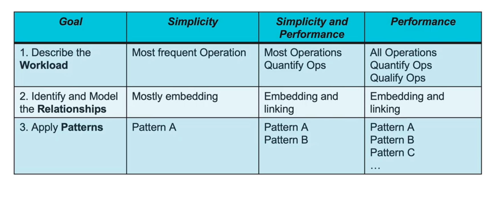

# Data modeling Methodology

designing our models can involve the following

- Identify the scenarios from requirement documents , or if we have production logs like a relational database we are migrating from and stats (# of reads , # of writes , .... ) we will analyze those.

- Business Domain Experts that can tell us how things work, their relations and exceptions. How many concurrent users we can expect and different domain area knowledge to how things are working now.
  
- Our Data modeling experts that can help us put things together.

The first phase of our job would be to

- size data, size machines
- list different operations and quantify them  (read,write).
- list different operations and qualify them.
- Make assumptions like a relation between *A* to *B* will be max 1: 1000 or 1: 1,000,0000. If our assumptions are wrong they will have an impact on our schema designs so we need to record them too.

The Second Phase of our job would be

- Identify the relationships and quantify them
- decide wether to embed or link
- Model our relationships

Finally, we apply Patterns to improve performance and make our data easier to access. so we use patterns to recognize the pattern we should apply a pattern in and apply it.

the out come of the above  phases are

- assumptions
- queries
- indexes
- data sizing
- operations
- collections
- fields
- shapes
- applied patterns

This methodologies are not always required ; we usually use this if our goal is performance focused; if we are more geared towards simplicity we can skip most of them.

