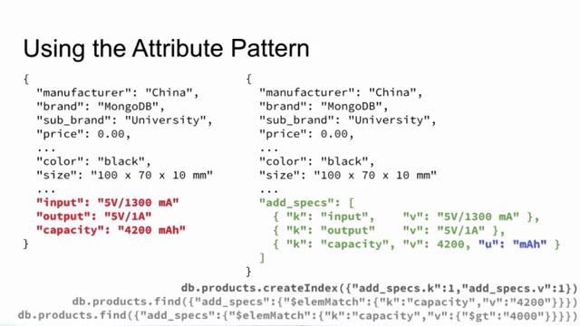

# Attribute Pattern


- Adds organizations to
  - common characteristics
  - rare/unpredictable fields
- Reduces the number of indexes

To use it transpose keys/values as arrays of sub-documents for form :

```js
    {"k":"key","v":value}
```

# example 1:

imagine we have the following  documents in our products collection.
we want to query by product specification


some fields are shared , others unique to each document , others have different units.
Querying , updating such documents with wide range of fields can be difficult. we will need to create a wide range of indexes to handle different documents cases.

index on "capacity"

```js
    db.products.find({"capacity":{$gt: 4000}})
```

index on on "output"

```js
    db.products.find({"output":"5v"})
```

Attribute pattern offers a solution for such scenarios:

1. first we identify the fields we want to transpose
2. for each field we identified we create key value pair



# example 2:

A document representing a movie:
we want to query movies released between two dates.


