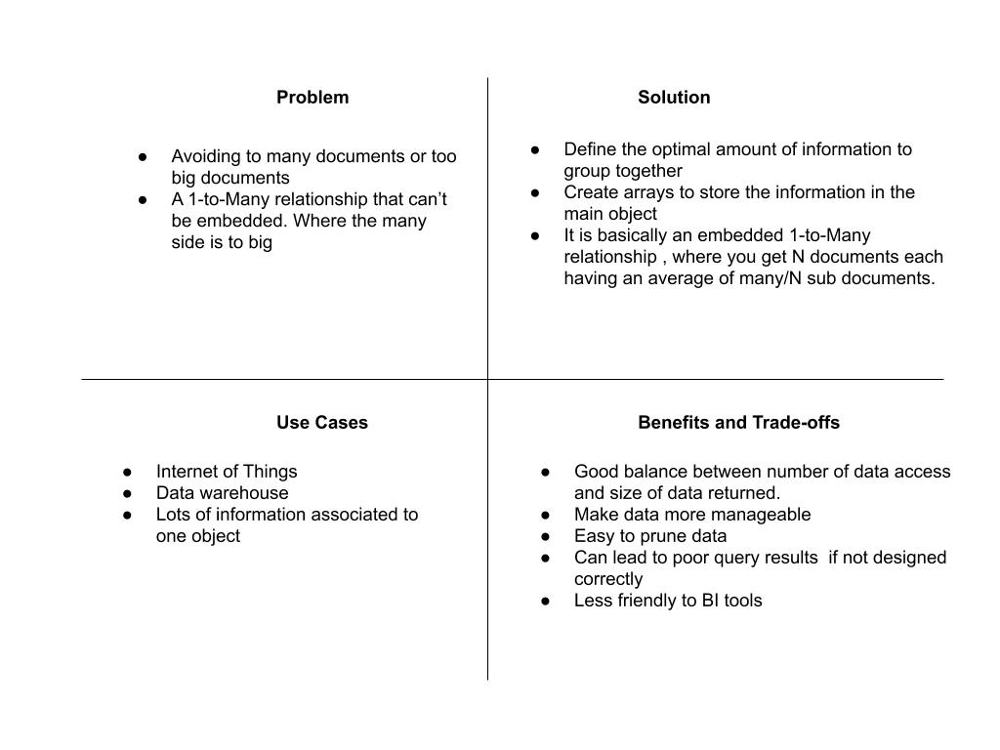

# Bucket pattern



In a bucketing pattern we have one main document and a bucket inside it that holds the one to many relationship. Bucketing is synonyms to Grouping data.

example :

imagine a a collaboration platform, we will have chat windows we call channel; in our chat windows we care for recent messages i.e. sorted by recent to old.

chat window between user1 and user2 is channel12

to store this chats in channels we can do:

- one document per message (not using bucket pattern)

  ```js
    {
        "channel_id":"12",
        "name":"userA_userB",
        "senderId":"user1",
        "date": ISODate("2020-05-12T03:14:16"),
        "message": "Hi, how are you"
    }
  ```

  what if we have millions of users would this be realistic ? this poses some issues as our application scales in terms of data and index size.

- keep all the messages for a single channel in a single document (bucketing by channel)
  
    ```js
    {
        "channel_id":"12",
        "name":"userA_userB",
        "date": ISODate("2020-05-12T03:14:16"),
        "message":[
            {
                senderId:"user1",
                data:"Hi, how are you",
                "date": ISODate("2020-05-12T03:14:16"),
            },
            {
                senderId:"user2",
                data:"I am good",
                "date": ISODate("2020-05-12T03:15:19"),
            },
        ]
    }
  ```

- one document per channel , per day (bucketing by channel and day)

     ```js
    {
        "channel_id":"12",
        "name":"userA_userB",
        "data": ISODate("2020-05-12"),
        "message":[
            "Hi, how are you",
            "I am good",
            "what you up to",
            "learning mongodb"
        ]
    },
    {
        "channel_id":"12",
        "name":"userA_userB",
        "data": ISODate("2020-05-13"),
        "message":[
            "Good morning"
        ]
    }
  ```

another example where bucketing is utilized is in scenarios where we have stream of data like in IOT devices writing to our database.

consider where IOT devices write temperature every minute to our database:

we can store each record as a document

```js
    {
        sensor_id: 12345,
        timestamp: ISODate("2019-01-31T10:00:00.000Z"),
        temperature: 40
    }

    {
        sensor_id: 12345,
        timestamp: ISODate("2019-01-31T10:01:00.000Z"),
        temperature: 40
    }

    {
        sensor_id: 12345,
        timestamp: ISODate("2019-01-31T10:02:00.000Z"),
        temperature: 41
    }
```

or we can use bucketing and bucket it by an hour

```js

{
    sensor_id: 12345,
    start_date: ISODate("2019-01-31T10:00:00.000Z"),
    end_date: ISODate("2019-01-31T10:59:59.000Z"),
    measurements: [
       {
        timestamp: ISODate("2019-01-31T10:00:00.000Z"),
        temperature: 40
       },
       {
        timestamp: ISODate("2019-01-31T10:01:00.000Z"),
        temperature: 40
       },
       …
       {
        timestamp: ISODate("2019-01-31T10:42:00.000Z"),
        temperature: 42
       }
    ],
   transaction_count: 42,
   sum_temperature: 2413
}
```

when using bucket pattern we can face the following challenges :

- random insertion or deletion in buckets
- Difficult to query and  sort across buckets
- Works best when complexity is hidden through the application code
