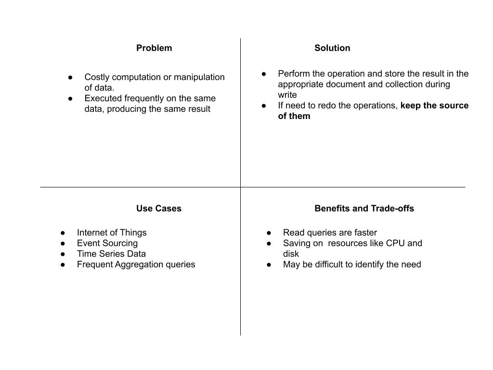
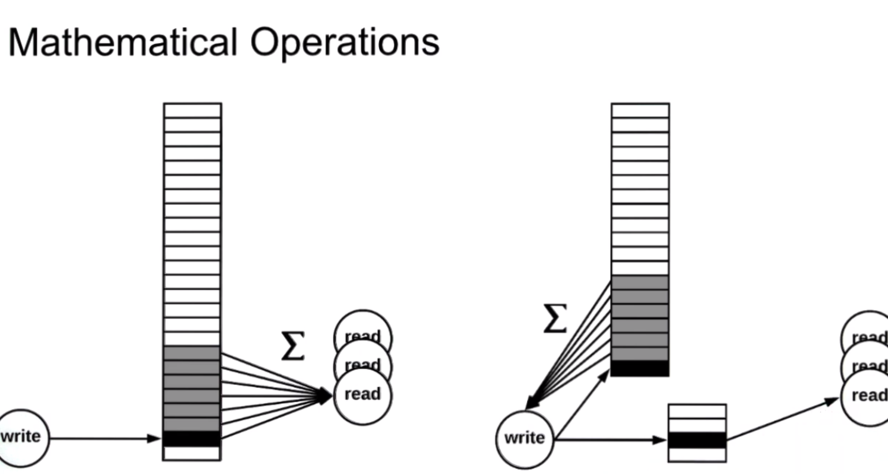
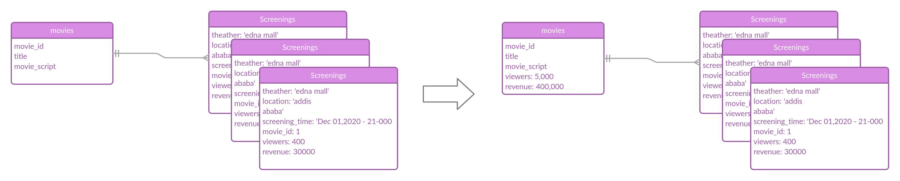
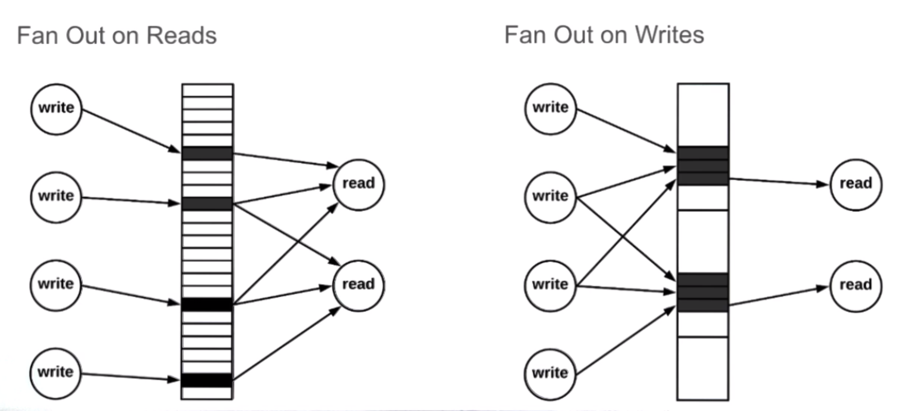
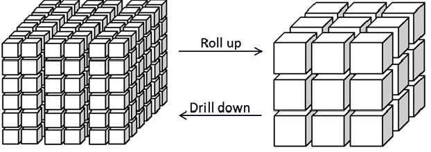
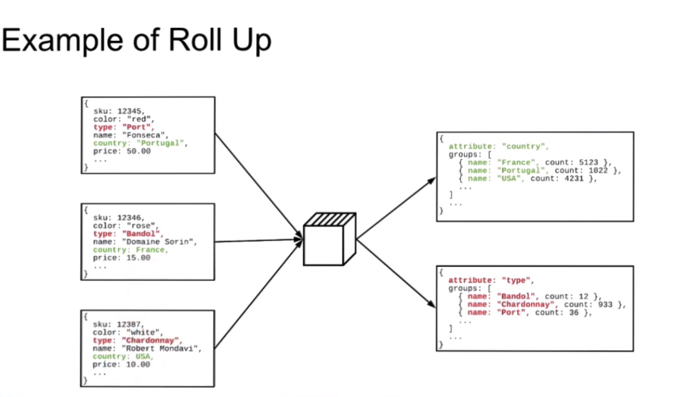

# Computed Pattern

Computed pattern is best used with data operations that are computation or transformation intensive. Computation or transformation operations usually have to do a lot of row scans that can be costly.

- **Mathematical operations**
    
  - (Finding Sum ,average , or median , total count)
  - get get order total, avg (1000 line items in order) by using computed pattern it will be a thousand fewer computation and thousand fewer reads.

     A real world example of this would be getting the total revenue and viewers of a movie from its different screenings at different cinemas.

     

- **Fan out Operations**

Fan out operations are operations that require us to do many tasks to do one logical task.

example:  

When you post on facebook your friends get a notification. your 1 operation (posting) -> 1000 friends get notified.

There are two types of fan out operations

- **Fan out on read:**
  - in order to return the appropriate data we must fetch data from different locations.
  - Used when consistency
  - e.g. building your social feed when you open the feed page , it queries every friend you have and get their activity since the last time your were online.
- **Fan our on write**
  - A logical write operation translates in to several writes to different documents
  - used when we want read to be very fast and data consistency is not a priority ,
  - e.g. in a social app when a person posts something , it updates the feed collection of each of  their friends. (read is fast, write to friends feeds can be done in batch or latency is acceptable. everybody doesn't need to see your post immediately a minute or more delay is acceptable.)

- **Roll up operation**

    
    Opposite of drill down operations.

  - e.g.
    - grouping categories together in a parent category
    - grouping time based data from small interval to large once
    - reporting summaries yearly, daily, monthly , quarterly ,....
    - 

we use Computed pattern when:

- reduce latency for read operations
- overuse of CPU
