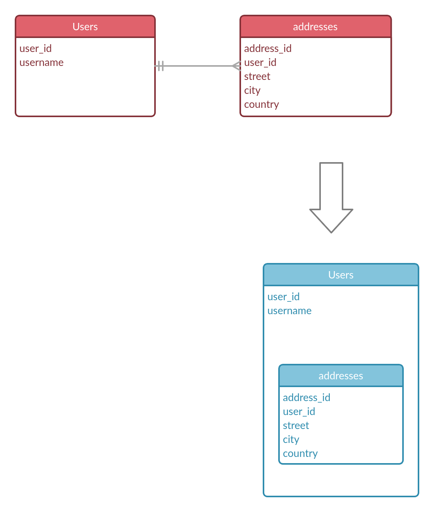
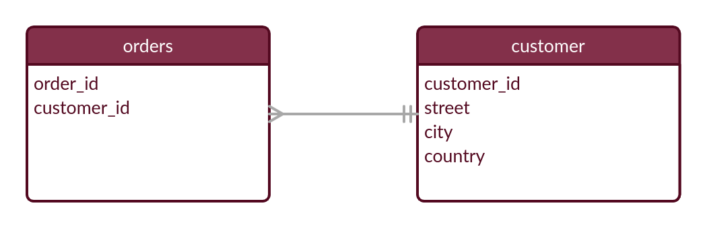
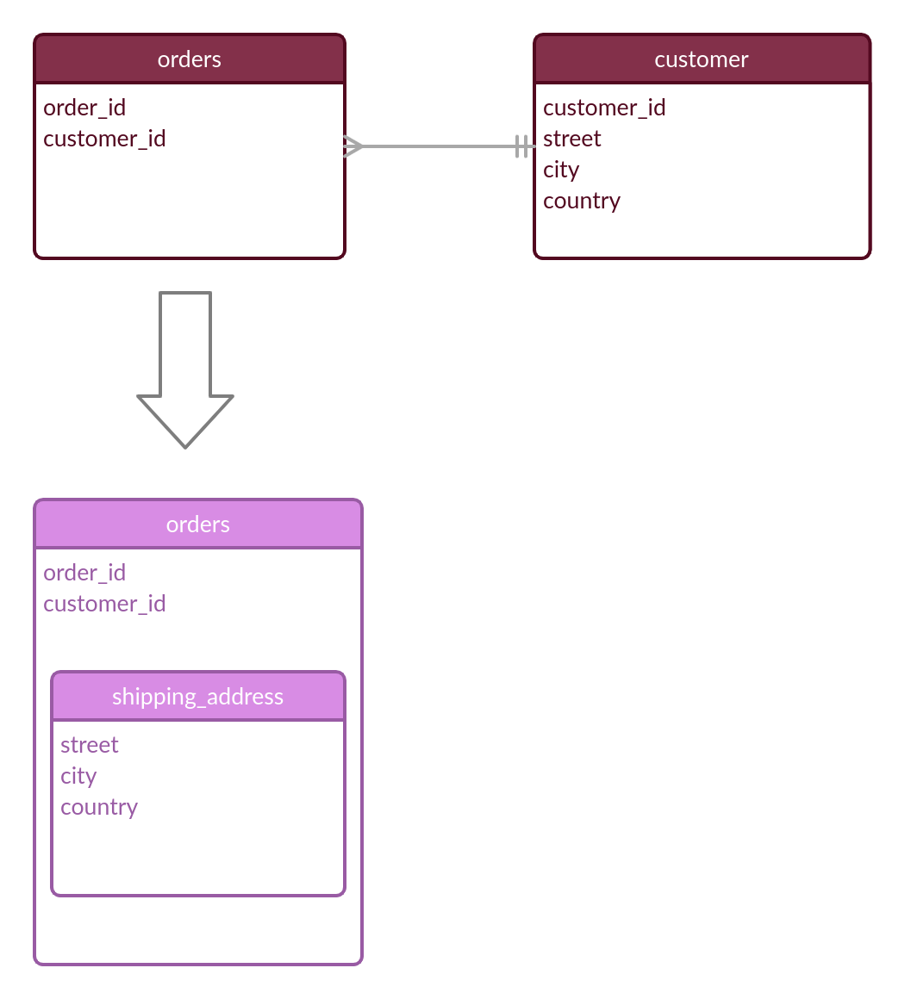

# Extended Reference pattern

helps us avoid join hell with one-many and many to many relationships by embedding.
so far we have seen embedding where we embedded the many side inside the the one side.

we embed the many side inside the one side because of how the data is accessed. for example in the above figure it wouldn't make sense to access an address with out a user, such scenarios where the many sides need the one to make sense we embede many in one.

There are other scenarios where the focus of our queries is the many side and the many side can exist by themselves. such relationships are called many-to-one. many to one are the same as one-to many except the focus of our queries is the many side.

in the diagram many orders belong to a customer or a customer has many orders.

**so why would we want to use many-to-one instead of one-to-many ?**

imagine our application focuses on order management and most of our queries focus on getting orders instead of getting all orders for a customer.

to use extended reference pattern :

- we embed the "One" side , of a "one-to-many" relationship, into the "Many" side.
- we embed **only the part** that we need to join often **and data that wont change often**.
  
  

using this pattern consider the following points to manage duplication

- Minimize duplication
  - select fields that do not change often
  - bring only the fields you need to avoid joins
- After the source is updated (the 'One' Side) e.g. customer address gets updated:
  - identify which extended references to chang
  - when to change those extended references (maybe in a batch job , stale data might be ok)
- Duplication might be correct and you want the data to be stale or reflect values at a certain point in time.
  - e.g. if customers address change after our order, we dont want to our order to reflect the new addresses rather to keep the previous address it was issued at.
