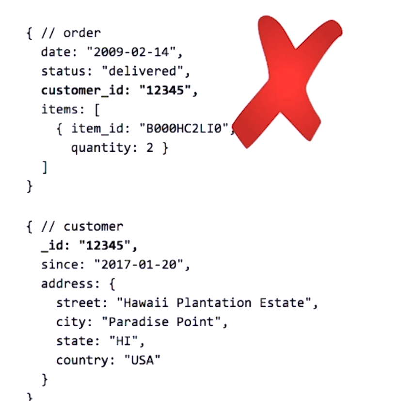
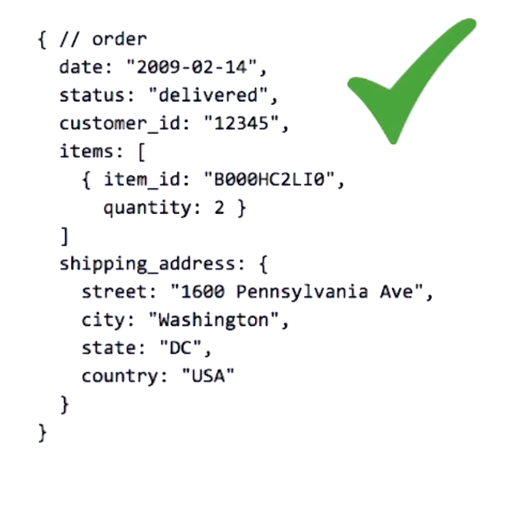
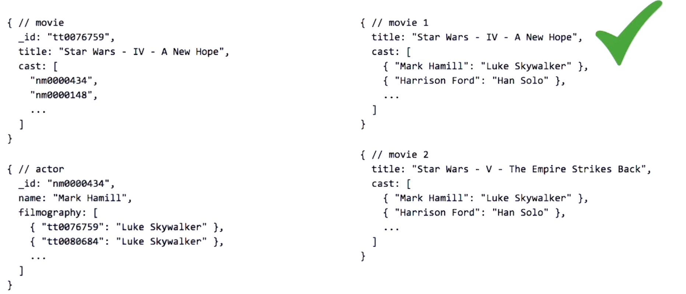
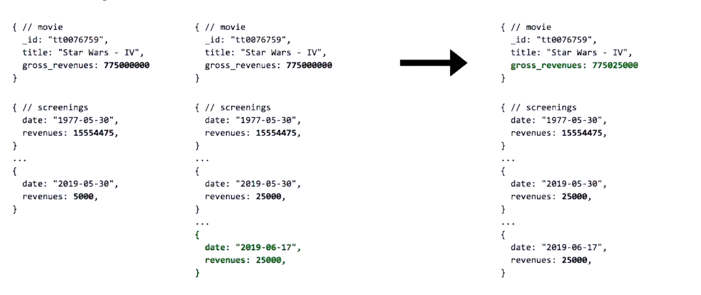
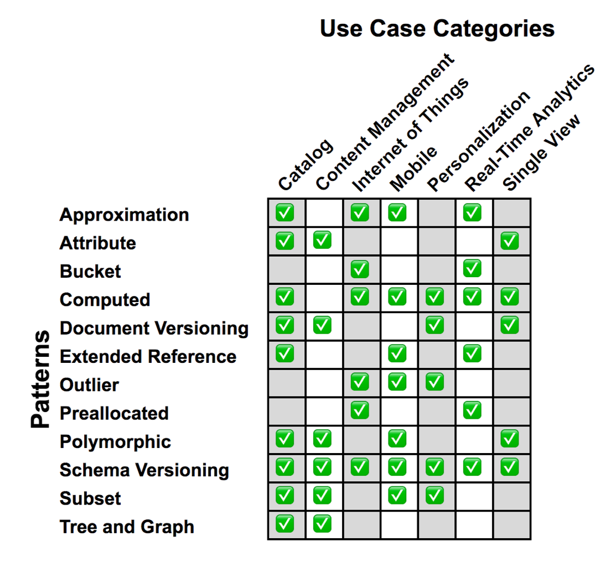

# Data Modeling Patterns

Patterns are reusable units of knowledge, they are not full fledged solutions rather reusable units.

Applying patterns may lead to

- ## Duplication of data across documents.

  - usually the result of embedding information in a given document for faster access.
  - While Duplication of data is considered a bad thing there are cases where duplication might be better. The key thing to understand is not every peace of data is affected the same by duplication

    | With out Duplication                                                    | With Duplication                                                            |
    | ----------------------------------------------------------------------- | --------------------------------------------------------------------------- |
    |  |  |
    

   
     
   

   

- ## Data staleness
  
- the volume of reads and writes can cause performance issues and we have to identify where it might be ok in our business to have stale data. HOW LONG CAN A USER TOLERATE NOT SEEING THE MOST UPTODATE DATA. what is the acceptable threshold for staleness.
- e.g.
  - showing a user if an item is available to buy vs showing a user how many people viewed the product.

- ## Data Integrity Issues (referential Integrity):

  - Linking information between documents (remember we have no concept of foreign keys in mongodb and we enforce such integrity concerns at application level.)
  - We might need to write extra application side logic to ensure referential integrity (cascading delete & updates)

## To tackle this concers we can use

- **Bulk Updates** to resolve duplications
- **Change Streams (to resolve referential integrity and data staleness)**
  - Change streams allow applications to access real-time data changes without the complexity and risk of tailing the oplog. Applications can use change streams to subscribe to all data changes on a single collection, a database, or an entire deployment, and immediately react to them.
- **Single Documents (Embedding instead of linking it)**
- **Multi document transactions**
  - for data the requires referential integrity and can not afford inconsistencies

Next we will see different patterns

- [Attribute pattern](/course/dataModeling/patterns/atrributePattern.md)
- [Extended Reference Pattern](/course/dataModeling/patterns/extendedReferencePattern.md )
- [Subset pattern](/course/dataModeling/patterns/subsetpattern.md)
- [Computed Pattern](/course/dataModeling/patterns/computedPattern.md)
- [Bucket Pattern](/course/dataModeling/patterns/bucketPattern.md)
- [Schema Versioning Pattern](/course/dataModeling/patterns/schemaVersioningPattern.md)
- [Tree patterns](/course/dataModeling/patterns/tree.md)

