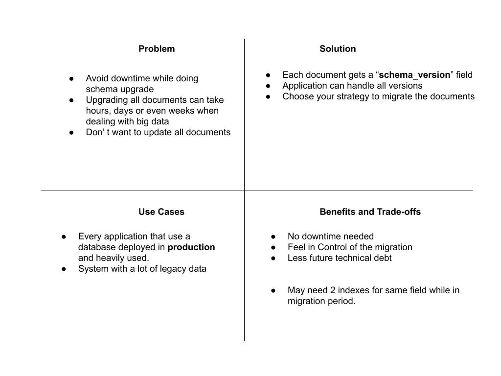
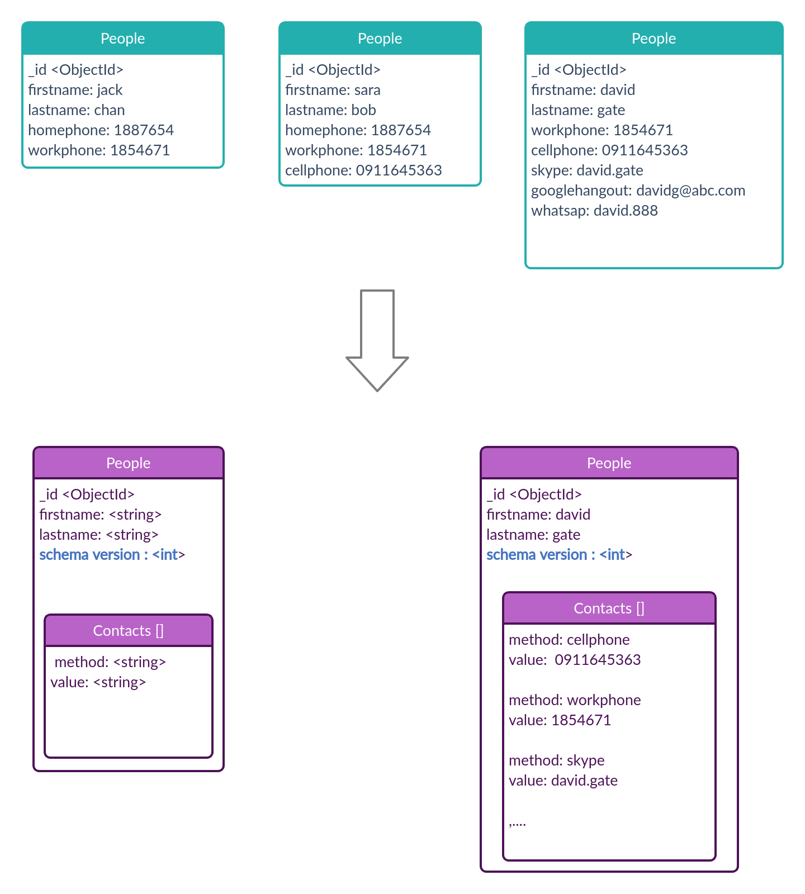
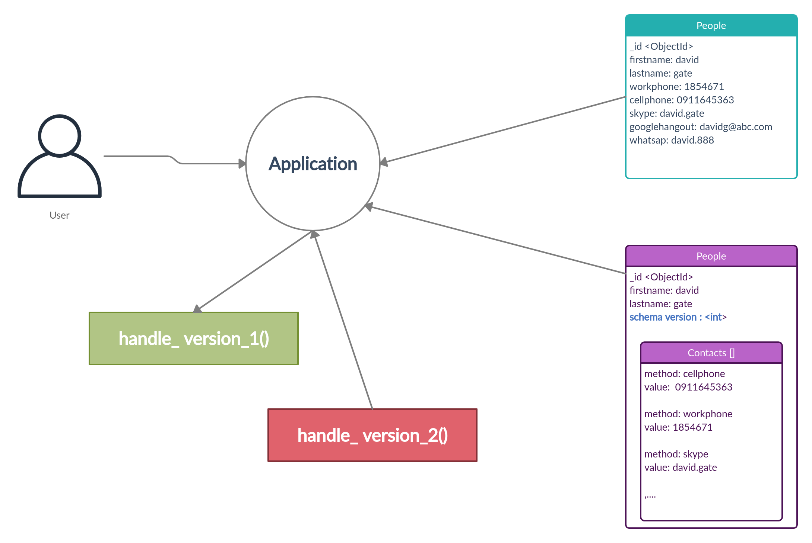

# Schema Versioning Pattern

what are the challenges of **Alter Table** in Relational Databases :

- modifying the schema of our database
- you need to run a destructive command that can delete some data and can not be rolled back.
  - dropping columns , indexes
- it acquires locks and might require down time
- might require a table copy i.e. disk space

In mongoDB world we don't have such problems. Documents in mongodb have a polymorphic character i.e. documents can have different shapes , different fields or different types for a field.

lets take an example:

consider the diagram below, we have people collection and  each document below has different signatures, to solve the unpredictable fields we used the attribute pattern and we also defined schema version so that each document can tell us which version they adhere to.

using the versioning pattern the logic to handle versioning moves to our application layer. we can follow the following steps to do versioning and upgrade our schemas :

- Modify our application (read/process all version of docs)
  - have different handler per version (if/else statements)
  - reshape the doc before processing it
  - new documents are written in the latest version
- Update all application servers
  - Install updated application
  - remove old process
  - we can update with batch jobs to update previous versioned docs
- Once migration is completed
  - remove the code to process old version

As you can see there are no down times and our application can support both versions; and to migrate we can choose different strategies and we are not time boxed.

