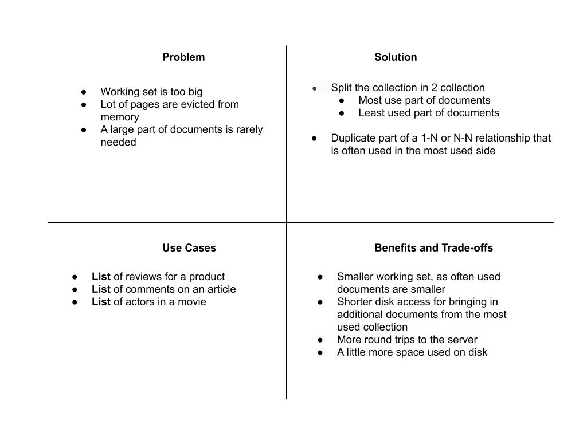
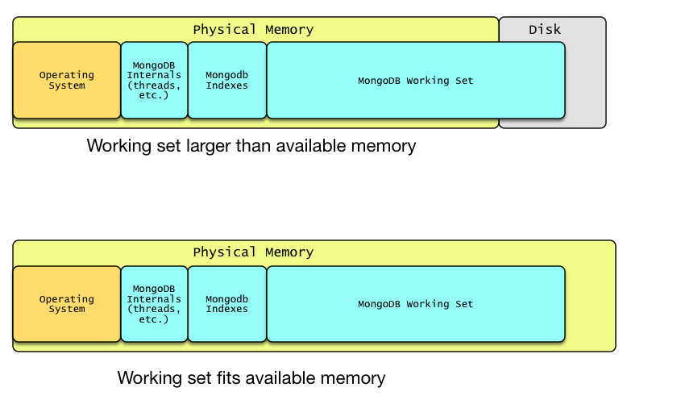
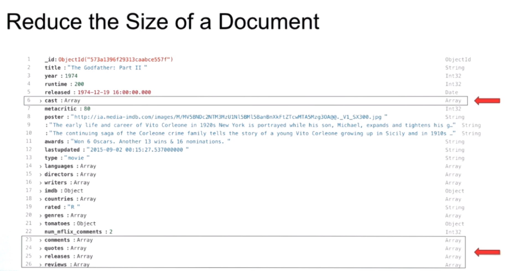
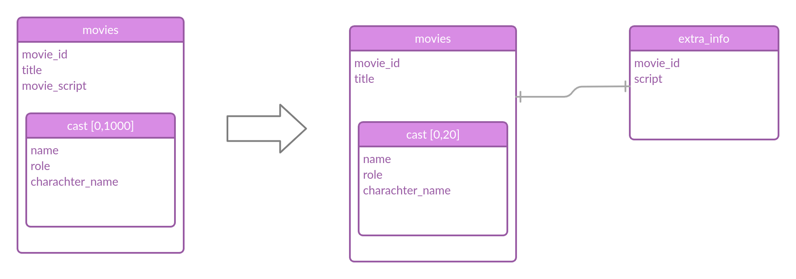
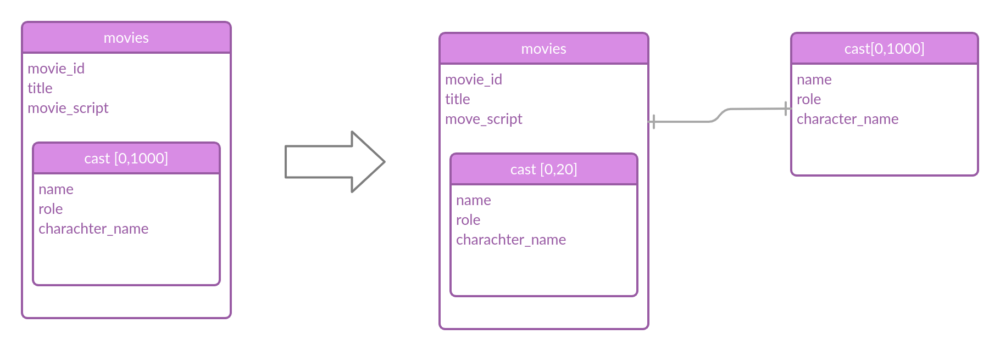

# subset pattern

what is a working set ?

 MongoDB relies heavily on caching objects and indexes in RAM. The primary reason to do so is to leverage the speed at which data can be retrieved from RAM as compared to physical disks.

At a high level, the working set comprises the most frequently accessed data and indexes. For performance reasons, it is highly recommended that the server should have sufficient RAM to fit the **entire** working set while keeping sufficient room for other operations and services running on the same server.

 

When our working set is big we can consider the following as solutions

- Add RAM (Scale Vertically)
- Scale with Sharding (Scale Horizontally)
- reduce the size of the working set
  - Breaking up large documents

For example : below we have a movies document , when listing movies we don't need all other information's like case , comments , quotes , reviews at once. We can load them through time but we wont need them at once on the working set.

For fields that have a one-to-one relationship, the subset pattern recommends reducing the working set by moving some fields with one to one relationships to their own collection.

for fields that have a one-to-many relationships, the subset pattern recommends reducing the working set by only keeping a subset of the 'N' relationship in the document . i.e. if we had 1000 casts we keep only 20 of them and the rest in another document.

the main concept of the subset pattern is dividing data in to part that is frequently accessed and part that is less frequently accessed. the main benefit is reducing the working set size
