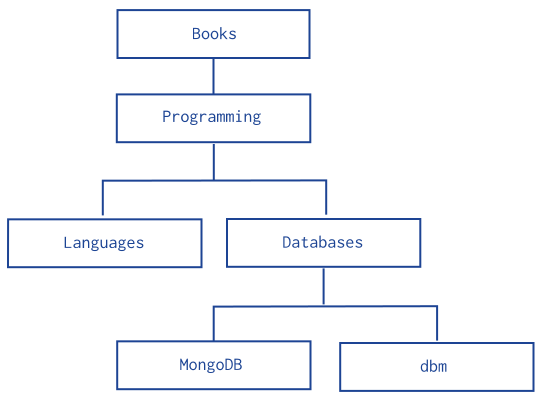
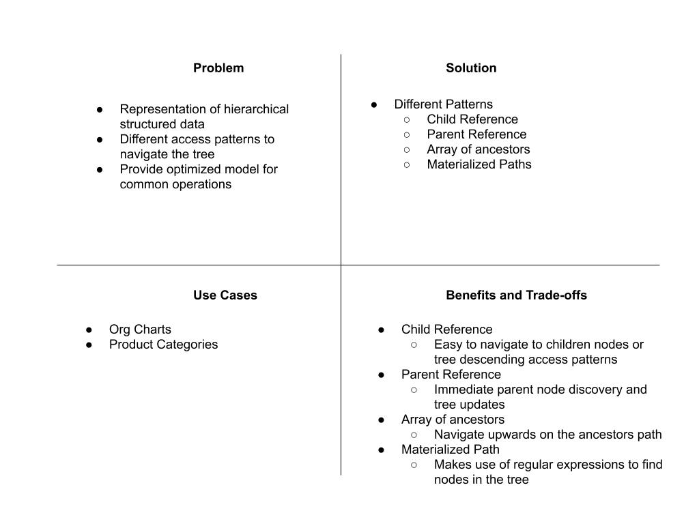

# Tree pattern

Tree pattern is about modeling hierarchical structures ( tree structures). example of tree structures can be  hierarchy in a company CEO -> CTO , CFO ,.... , books subject area structure  Books -> programming -> Languages -> C# , and so on..

Hierarchical node relationships comes with common operations ; this operations are :

- **who are the ancestors of node X ?**
- **who reports to Y ?**
- **Find all nodes that are under Z ?**
- **Change all categories under N ot under P**

The document model offers the following patterns for modeling tree structures.

- Parent References
- Child References
- Array of Ancestors
- Materialized paths

 Imagine we are building a model for an online book store and we have the following hierarchy of book categories.



## Parent Reference pattern :

The Parent References pattern stores each tree node in a document; in addition to the tree node, the document stores the id of the node’s parent

```js
    db.categories.insertMany( [
    { _id: "MongoDB", parent: "Databases" },
    { _id: "dbm", parent: "Databases" },
    { _id: "Databases", parent: "Programming" },
    { _id: "Languages", parent: "Programming" },
    { _id: "Programming", parent: "Books" },
    { _id: "Books", parent: null }
    ] )
```

getting the parent of a node is fast and straight forward, and we can create an index on the parent field to enable fast search.
  
- **who is the parent of Y ?**    (:heavy_check_mark:)

  ```js
    db.categories.findOne( { _id: "Y" } ).parent
  ```
  
- **who reports to Y ?**  (:heavy_check_mark:)

```js
    db.categories.find( { parent: "Y" } )
```

- **Who are the ancestors of Node X ?** (:warning: using a join)

```js
    // all ancestors
    db.categories.aggregate([
        {
            $graphLookup: {
                from:'categories',
                startsWith: '$name',
                connectFromField: 'parent',
                connectToField: 'name',
                as: 'ancestors'
            }
        }
    ])
```

- **Change all categories under N to under P**(:heavy_check_mark:)
  
  ```js
        db.categories.updateMany(
            {parent: 'N'},
            {$set:{parent: 'P'}}
        )
  ```

- **find all nodes that are under Z** :warning:

```js
    //requires us to iterate each document and check if the parent of the document is Z or its parents -> parent -> parent is Z very expensive.
```

## Child Reference pattern :

The Child References pattern stores each tree node in a document; in addition to the tree node, document stores in an array the **id(s)** of the node’s children.

```js
    db.categories.insertMany(
        [
            { _id: "MongoDB", children: [] },
            { _id: "dbm", children: [] },
            { _id: "Databases", children: [ "MongoDB", "dbm" ] },
            { _id: "Languages", children: [] },
            { _id: "Programming", children: [ "Databases", "Languages" ] },
            { _id: "Books", children: [ "Programming" ] }
    ] )
```

The query to retrieve the immediate children of a node is fast and straightforward, and we can create an index on the field children to enable fast search by the child nodes:

- **who are the ancestors of node X ?** (:warning:)

    this query will give us its siblings but to get its parent ancestors we might need to check if its parents also has other ancestors which is complicated.

    ```js
        db.categories.find( { children: "MongoDB" } )
    ```
  
- **who reports to Y ?** (:warning:)

    for example if we are to query who reports to programming it would be its children and the children of its children which is complicated.

- **Find all nodes that are under Z ?** (:heavy_check_mark:)

    ```js
        db.categories.findOne( { _id: "Databases" } ).children  
    ```

- **Change all categories under N ot under P** (:warning:)

    since finding those who report to N is costly and challenging this is also not ideal.

Finally,  The Child References pattern provides a suitable solution to tree storage as long as no operations on subtrees are necessary.

## Array of ancestors pattern :

The Array of Ancestors pattern stores each tree node in a document; in addition to the tree node, document stores in an **ordered** array with **id(s)** of the node’s ancestors or path.

```js
    db.categories.insertMany( [
    { _id: "MongoDB", ancestors: [ "Books", "Programming", "Databases" ], parent: "Databases" },
    { _id: "dbm", ancestors: [ "Books", "Programming", "Databases" ], parent: "Databases" },
    { _id: "Databases", ancestors: [ "Books", "Programming" ], parent: "Programming" },
    { _id: "Languages", ancestors: [ "Books", "Programming" ], parent: "Programming" },
    { _id: "Programming", ancestors: [ "Books" ], parent: "Books" },
    { _id: "Books", ancestors: [ ], parent: null }
] )
```

- the query to retrieve the ancestors or path of a node is fast and straightforward/

- **who are the ancestors of node X ?** ("heavy_check_mark:)

    ```js
        db.categories.findOne( { _id: "MongoDB" } ).ancestors
    ```

- **who reports to Y ?** (:heavy_check_mark:)

   ```js
        db.categories.find( { ancestors: "Programming" } )
    ```

- **Find all nodes that are under Z ?** (:heavy_check_mark:)

    ```js
        db.categories.find({ancestors:{$regex:/,Books,/}})
    ```

- **Change all categories under N ot under P** (:warning:)

    ```js
        db.categories.update({ancestors:"Programming"},{$set:{"ancestors.$[ele]":"N"}},{arrayFilters:[{ele:{$eq:"Programming"}}],multi:true})
    ```

    <br>

using array of ancestor pattern:

- we can easily query by the field ancestors to find all its descendants:

- This is a good choice to work with sub trees.
- by creating an index on the elements of the ancestors field we can efficiently get descendants and ancestors

## Materialized paths :

The Materialized Paths pattern stores each tree node in a document; in addition to the tree node, document stores as a string the id(s) of the node’s ancestors or path with some separator in our example below we used comma.

Although the Materialized Paths pattern requires additional steps of working with strings and regular expressions, the pattern also provides more flexibility in working with the path, such as finding nodes by partial paths.

```js
    db.categories.insertMany( [
   { _id: "Books", ancestors: null },
   { _id: "Programming", ancestors: ",Books," },
   { _id: "Databases", ancestors: ",Books,Programming," },
   { _id: "Languages", ancestors: ",Books,Programming," },
   { _id: "MongoDB", ancestors: ",Books,Programming,Databases," },
   { _id: "dbm", ancestors: ",Books,Programming,Databases," }
] )
```

- **who are the ancestors of node X ?** (:heavy_check_mark:)

  ```js
        db.categories.find({ancestors:/\,Databases$/})
  ```

- **who reports to Y ?** (:warning:)

    ```js
        db.categories.find( { ancestors: /,Programming,[a-z]$/ } )
    ```

  - queries wont be efficient

- **Find all nodes that are under Z ?** (:warning:)

    ```js
         db.categories.find( { ancestors: /,Programming,/ } )
    ```

  - queries wont be efficient. <br>

- **Change all categories under N ot under P** (:warning:)
  
    can be challanging based on the node we are moving.

    <br>

- we can query to retrieve the whole tree sorting by the field path:

```js
    db.categories.find().sort( { path: 1 } )
```

- we can use regular expressions on the path field to find the descendants of programming

we can also retrieve the descendants of Books where the Books is also at the topmost level of the hierarchy:

```js
    db.categories.find( { path: /^,Books,/ } )
```

- we can get  descendants from Books to Databases

```js
    db.categories.find({path: /^\,Books,*Databases/i})
```

Indexing path may improve performance depending on the query:

- For queries from the root Books sub-tree (e.g. /^,Books,/ or /^,Books,Programming,/), an index on the path field improves the query performance significantly.

- For queries of sub-trees where the path from the root is not provided in the query (e.g. /,Databases,/), or similar queries of sub-trees, where the node might be in the middle of the indexed string, the query must inspect the entire index.

For these queries an index may provide some performance improvement if the index is significantly smaller than the entire collection.


