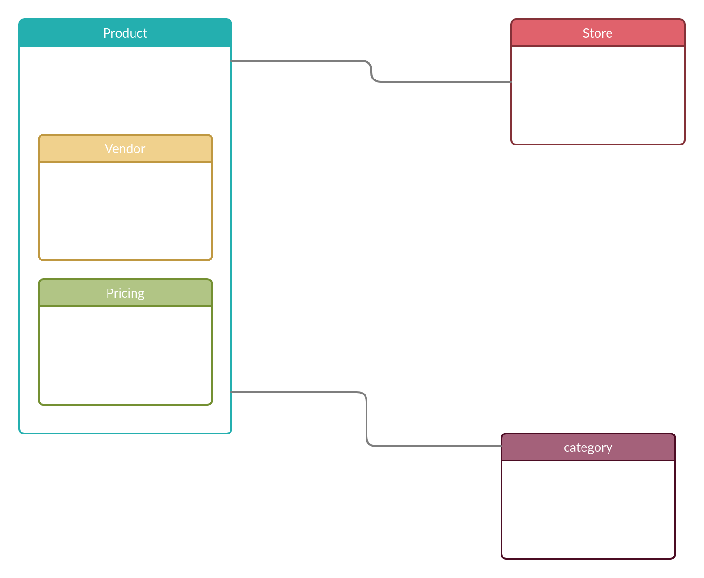

# Use Case example

lets imagine we are building an app for a large pharmacy. The pharmacy has 5 thousand stores through out the country and this stores receive requests and orders from clients in millions each day. The store checks its inventory for every request if the requested items are available , they also do a daily check to identify which items to restock. The pharmacy also checks every day which products to off shelf by checking different expiry dates and creates an analytics of how to move inventory based on expiry date.

## phase 1.1: lets list the operations

|                                | Operation | description                                                                  |
| ------------------------------ | --------- | ---------------------------------------------------------------------------- |
| check inventory balance        | read      | check inventory balance on request or order                                  |
| generate restock level reports | read      | analytics                                                                    |
| take orders                    | write     | write orders                                                                 |
| reserve products in inventory  | write     | reserves products when orders are made                                       |
| track requests                 | write     | records different requests made by users for analytics and understand demand |

## Phase 1.2: lets quantity/qualify the operations

*86400 seconds in a day*
*mongodb can handle tens and thousands of writes per second with in a single replica set*

|                      | Quantification                                             | Qualification                            |
| -------------------- | ---------------------------------------------------------- | ---------------------------------------- |
| inventory balance    | 1/mnt * 5000 store     83 request per second            | no stale data                            |
| restock level report | 1/day *5000 store* # of users    15000 requests per day | stale data is ok for some amount of time |
| write order          | 1/5mnt * 5000 stores     16 requests per second         | critical write                           |
| write requests       | 1/5mnt *5000 stores     16 requests per second          | *non critical write*                     |
| request analysis     | 1/day * # of users                                         | stale data is fine                       |
| inventory out        | 1/5mnt * 5000 stores     16 requests per second         | critical write                           |
| inventory in         | 5/day * 5000 store     0.2 requests per second          | critical write                           |

the above table gives us a good indication wether we need sharding or not, and at what scale our db will operate.

## Phase 1.3 Details of the important operations

| Atrribute             | value                                                                    |
| --------------------- | ------------------------------------------------------------------------ |
| Description           | Write Order                                                              |
| Frequency             | 16/sec                                                                   |
| Size                  | 100 bytes   this is the doc size we will save in our order collection |
| Consistency/Integrity | High                                                                     |
| Latency               | 5 sec                                                                    |
| Durability            | High                                                                     |
| Life/Duration         | 10 years                                                                 |
| Security              | None                                                                     |

## Phase 1.4 Sizing Disk Space

e.g.

Inventory:

- one year of data
- 150 bytes per product. *25000/day* 365
- 1.3 billion/year
- 1.3 Gigabyte/year storage needed

## Phase 2:

now we have an understanding of what our system is about the next step is identifying the relationships.

once we have identified relationships we decide on embedding or referencing  

## Phase 3 : Apply patterns

using different patterns we enhance and optimize our modeling ; we will learn patterns next.
