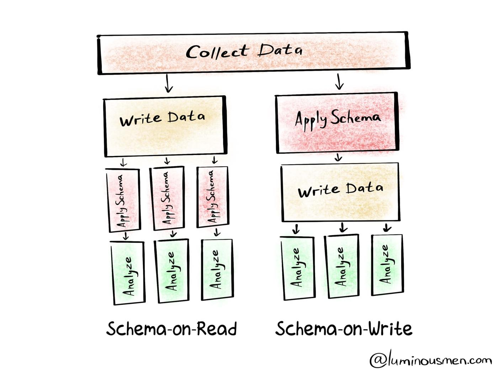
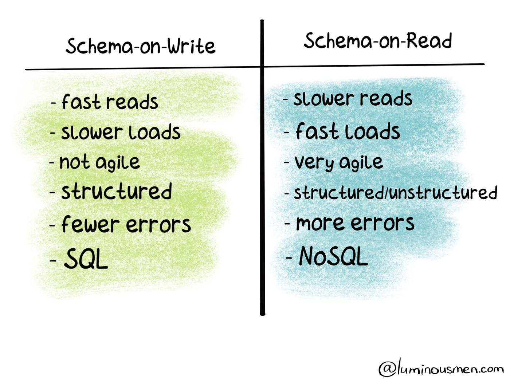
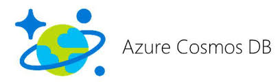
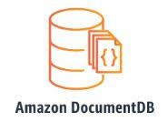

# What is Document database

A document database is a type of **nonrelational** database that is designed to
**store and query data as JSON-like documents**. Document databases make it easier for developers to store and query data in a database by using the same **document-model** format they use in their application code.

example:

Try to list down your full name age and top 3 movies you have seen their actors,  directors. On a piece of paper.

Name: Derese Getachew <br>
Age: Counting <br>
Movies:

- Title: Top Gun
  - Actors: Tom Cruise
    - Director: Tony Scott
    - link: (<https://en.wikipedia.org/wiki/Top_Gun>)
  - Title: Black panter
    - Actros : Chadwick Boseman , Michel B.Jordan
    - Director: Ryan Coogler
    - link : (<https://en.wikipedia.org/wiki/Black_Panther_(film>))

lets represent the same information using JSON

```json
{
    "name":"Derese Getachew",
    "Age": 32,
    "Movies":[
         {
            "title":"Top Gun",
            "actors":"Tom Cruise",
            "director":"Tony Scott",
            "link":"https://en.wikipedia.org/wiki/Top_Gun"
        },
         {
            "title":"Black patnther",
            "actors":"Chadwick Boseman , Michel B.Jordan",
            "director":"Ryan Coogler",
            "link":"https://en.wikipedia.org/wiki/Black_Panther_(film)"
        }
    ]
}
```

## What is a Schema

The structure of the data and the relationship between the data is called schema of the data.



- **Schema on Read**
  - The data is stored in its garble state (as it arrives) and we apply the structure to its query code.
  - Having data in its raw format gives us the freedom of adopting to future changes and playing with the data with out loss of information.
- **Schema on Write**
  - Force structure as a condition before data is written to data store.
  - Extensive data modeling at the beginning

the method of how a schema is designed can influence different behaviors in a datastore.



> Question : What happens when you have to change a column type in relational databases ?
> Do you drop the table, recreate the table and load all the data again ? what if there are  foreign keys also ?

## Characteristics of Document databases

1. NoSQL (not Only SQL)
2. Schemaless (saying that some level of schema design is inevitable)

## Popular Document Database

| Name                                                      | Description                                                                                                                                                                                                                                                                                                                |
| --------------------------------------------------------- | -------------------------------------------------------------------------------------------------------------------------------------------------------------------------------------------------------------------------------------------------------------------------------------------------------------------------- |
|          | MongoDB is a cross-platform document-oriented database program. Classified as a NoSQL database program, MongoDB uses JSON-like documents with optional schemas. MongoDB is developed by MongoDB Inc. and licensed under the Server Side Public License.                                                                    |
|          | **Azure cosmos DB** is Microsoft's proprietary globally-distributed, multi-model database service "for managing data at planet-scale" launched in May 2017. It is schema-agnostic, horizontally scalable and generally classified as a NoSQL database.                                                                     |
|         | **ArangoDB** is a multi-model database and provides support of graph, document, key/value, columnar, and relational data models.                                                                                                                                                                                           |
|            | **Apache CouchDB** is an open-source document-oriented NoSQL database, implemented in the concurrency-oriented language Erlang; it uses JSON to store data, JavaScript as its query language using MapReduce, and HTTP for an API.                                                                                         |
|  | **Amazon DocumentDB** is a fast, scalable, highly available, and fully managed document database service that supports MongoDB workloads. Amazon DocumentDB is designed from the ground-up to give you the performance, scalability, and availability you need when operating mission-critical MongoDB workloads at scale. |
|    | Elasticsearch is a search engine based on the Lucene library. It provides a distributed, multitenant-capable full-text search engine with an HTTP web interface and schema-free JSON documents. Elasticsearch is developed in Java.                                                                                        |

## More Reading and References

[What is No-SQL](https://www.mongodb.com/nosql-explained)<br>
[Why Schemaless Databse](https://www.mongodb.com/blog/post/why-schemaless)<br>
[Multi Model Database](https://en.wikipedia.org/wiki/Multi-model_database)
