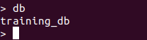

# Installing & Running MongoDb

If you already have git , docker & docker-compose installed on your machine or if you already have Mongodb installed on your machine, you can skip to [Run mongodb on Docker](#run-mongodb-on-docker)

## Install and Configure Mongodb on Bare Metal ( this is easy :smiley:)

[follow this guide](https://docs.mongodb.com/manual/tutorial/install-mongodb-on-windows/)

### Install on Windows

- Download the MongoDB msi installer from ­ <https://www.mongodb.comdownload-center#enterprise>
  
  - Right-click the Windows installer, select Run as Administrator, and follow
the instructions to install MongoDB.
  - Create \data\db directory in C:\ to store MongoDB data. Directory looks
  like “C:\data\db”.
  - Open the command prompt and navigate to the MongoDB installation
folder. Issue the ```mongod.exe``` command to start the MongoDB server, as
shown below

    

    You should get a message that states “Waiting for connection on port 27017.”

  - Open another command prompt and navigate to the MongoDb installation folder and execute the following command ```mongo.exe```  this will open the mongo shell as shown below.
  
       

## Install & configure MongoDb on Docker (not so easy :muscle:)

### Install Docker

[For Windows](https://docs.docker.com/docker-for-windows/install/) :warning:
This requires at list windows 7 64 bit OS and the machines virtualization enabled.
 <br>
[Install Docker Compose](https://docs.docker.com/compose/install/)

#### Run mongodb on Docker


1. Clone or Download this project
2. Open cloned / or extract the zipped file and open the folder
3. Open your terminal and change your working directory to the new folder
4. run the docker-compose, with shown commands below.

```sh
    docker-compose up -d
```

4. To see if everything has run successfully.

   1. Open your terminal and run.

    ```sh
        docker exec -it monogodb sh
    ```

    This will open a session in to your mongodb running container.

    2. run mongo shell

    ```
        mongo
    ```

    then run  <br>

    ```
        show dbs
    ```

    and you should see an output of

    ```sh
        admin   0.000GB
        config  0.000GB
        local   0.000GB
    ```

## Mongo Shell

The mongo shell is an interactive **JavaScript** interface to MongoDB.
You can use the mongo shell to **query** and **update** data as well as perform **administrative operations**.

in your mongo shell run ```help``` this will output all the commands you can use with the monogo shell.


in your  mongo shell run ```1+1``` what do you see ?

### creating a database & Collection

**use** command creates a database or selects a database. if the database name already exists then it will be switched to an existing database, otherwise it will create a new database.

lets create our training database: run on mongoshell

```sh
    use training_db
```


to check if the database was successfully created run

```sh
    show dbs
```


but our newly created database name is not in the list; the reason is our database is empty, it doesn't have any collections yet if we were to create a collection in it, it will be visible. But that doesnt mean the database is not created to prove that it is created using our previous use statement, we can use the ```db``` command To see the currently selected database name .

```sh
 db
```



If no database was selected the ```db``` command will show the "test" database name.

Next, lets create a collection:

```sh
    db.createCollection('demo')
```


now if we run ```show dbs``` our training_db will be shown in the list.


to see the collections inside our training_db we can run the command. (make sure you are using training_db)

```sh
show collections
```


Finally lets drop our database. ```db.dropDatabase``` command will drop currently selected database.

```
db.dropDatabase()
```


if we now check our database list again our training database doesnt exist in the list anymore.

[You can find Detailed info about Mongo Shell Methods by following this link.](https://docs.mongodb.com/manual/reference/method/)
