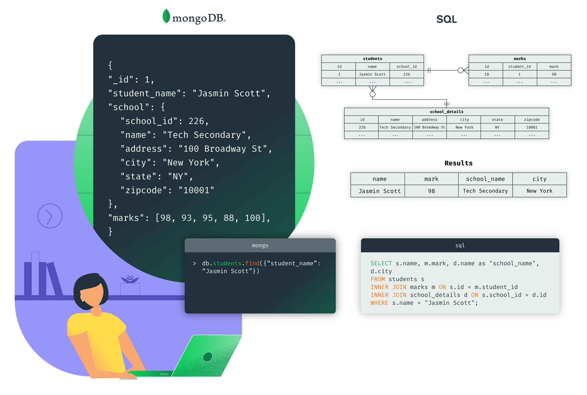

# Intro to MongoDB

> by Derese Getachew & Bsquare IT Services

## Course

1. [Introduction to Document Databases](course/documentDatabase.md)

2. [Installing & Running MongoDb](course/installingRunningMongoDb.md)

3. [Building blocks of MongoDb](course/buildingBlocks/buildingBlocks.md)

4. [CRUD Operations](course/crud.md)
   1. [Insert Documents](/course/crud/insert.md)
   2. [Query Documents](/course/crud/read.md)
   3. [Update Documents](/course/crud/update.md)
   4. [Delete Documents](/course/crud/delete.md)

5. Data Modeling

6. Indexing

7. Security

8. Monitoring

9. Exercises

10. Shopping Cart with Product Reservation
11. Shopping Cart with no product Reservation
12. Theater Reservation
13. Blog Comments as Slices

# Things we didn't cover in detail or at all here :

1. Transactions
2. Sharding
3. Aggregations
4. Collation

## Resources

- [Mongodb Docs]()
- [MongoDB Installation]()
- [MongoDB Glossary](https://docs.mongodb.com/manual/reference/glossary/#term-journal)
